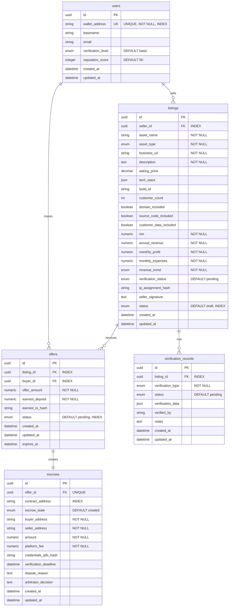

# Database Schema Documentation

## Overview

The Valyra backend uses PostgreSQL (via Supabase) with the following core tables to support the AI-powered M&A marketplace.

## Entity Relationship Diagram

## Table Descriptions

### Users
Stores platform users (both buyers and sellers).

**Indexes:**
- `wallet_address` (unique)
- `id` (primary key)

**Constraints:**
- `reputation_score` CHECK (reputation_score >= 0 AND reputation_score <= 100)

### Listings
Digital assets listed for sale.

**Indexes:**
- `seller_id`
- `status`
- `verification_status`

**Foreign Keys:**
- `seller_id` → `users.id`

### Offers
Buyer offers on listings with earnest deposits.

**Indexes:**
- `listing_id`
- `buyer_id`
- `status`

**Foreign Keys:**
- `listing_id` → `listings.id`
- `buyer_id` → `users.id`

**Business Logic:**
- Offers expire after 24 hours
- Earnest deposit is 5% of offer amount

### Escrows
Tracks on-chain escrow contracts and states.

**Indexes:**
- `offer_id` (unique)
- `contract_address`
- `escrow_state`

**Foreign Keys:**
- `offer_id` → `offers.id`

**Business Logic:**
- Platform fee is 2.5% of amount
- Verification period is 72 hours from delivery

### Verification Records
Tracks various verification checks for listings.

**Indexes:**
- `listing_id`
- `verification_type`
- `status`

**Foreign Keys:**
- `listing_id` → `listings.id`

**Business Logic:**
- JIT re-verification: records can expire and require re-check

## Enums

### VerificationLevel
- `BASIC` - Email domain match, website accessibility
- `STANDARD` - DNS verification, registrar proof
- `ENHANCED` - OAuth revenue verification, Build ID verification

### AssetType
- `SAAS` - Software as a Service
- `ECOMMERCE` - E-commerce store
- `CONTENT` - Content site/blog
- `COMMUNITY` - Community/forum
- `OTHER` - Other digital assets

### RevenueTrend
- `GROWING` - Revenue increasing
- `STABLE` - Revenue stable
- `DECLINING` - Revenue declining

### ListingStatus
- `DRAFT` - Not yet published
- `ACTIVE` - Live on marketplace
- `SOLD` - Successfully sold
- `PAUSED` - Temporarily hidden

### OfferStatus
- `PENDING` - Awaiting seller response
- `ACCEPTED` - Seller accepted
- `REJECTED` - Seller rejected
- `EXPIRED` - 24h window passed

### EscrowState
- `CREATED` - Escrow created
- `FUNDED` - Buyer deposited funds
- `DELIVERED` - Seller uploaded credentials
- `CONFIRMED` - Buyer confirmed receipt
- `DISPUTED` - Dispute raised
- `RESOLVED` - Dispute resolved
- `COMPLETED` - Funds released to seller
- `REFUNDED` - Funds returned to buyer

### VerificationType
- `DNS` - DNS TXT record verification
- `BUILD_ID` - Build ID verification
- `OAUTH_STRIPE` - Stripe OAuth verification
- `OAUTH_ANALYTICS` - Google Analytics OAuth
- `GITHUB_REPO` - GitHub repository access
- `EMAIL_DOMAIN` - Email domain verification

## Migration Strategy

1. **Initial Schema** - Create all tables with basic structure
2. **Indexes** - Add performance indexes on foreign keys and frequently queried columns
3. **RLS Policies** - Implement Row Level Security (Supabase)
4. **Extensions** - Enable pgvector for AI embeddings (future)

## Row Level Security (RLS) Policies

### Users Table
- Users can read their own data
- Users can update their own profile
- Platform can create users

### Listings Table
- Anyone can read ACTIVE listings
- Sellers can CRUD their own listings
- Platform can update verification status

### Offers Table
- Buyers can read their own offers
- Sellers can read offers on their listings
- Buyers can create offers
- Sellers can update offer status

### Escrows Table
- Buyers and sellers can read their own escrows
- Platform can update escrow state

### Verification Records
- Anyone can read verification records for ACTIVE listings
- Platform can create/update verification records
